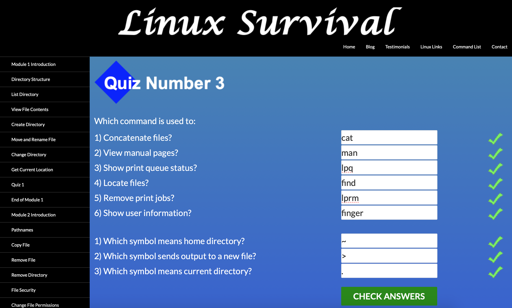

# kottans-backend

## Git and Github

Git and Github tutorials made me do all the changes in the console) this way it reminded me how it can be done without Sourcetree :)

My cat Vanya was inspiring me all the time.

## Unix Shell

Honestly, I'm a mac user for around 10 years, and usually used terminal only for quick python scripts and basic commands (pwd, cd, ls etc), all other manipulations with files were made using UI tools) After this Unix Shell course I know a lot of useful commands, and I intend to use them when needed, otherwise most of them will be forgotten in some time.

## Git Collaboration

As a GitHub user for more then four years, I found this collaboration course totally awesome. It reminded me all the GitHub basics and, from my personal point of view, covered most of the applicable use cases with it. 

