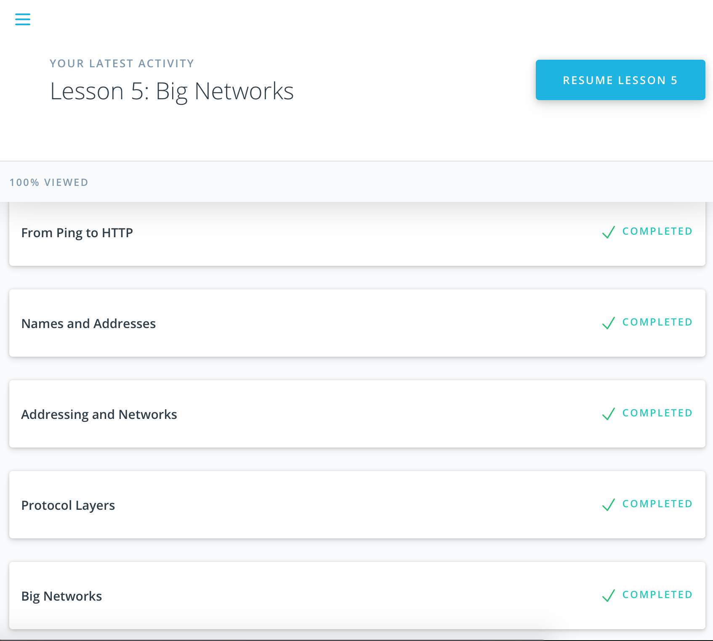

# kottans-backend

## Git and Github

Git and Github tutorials made me do all the changes in the console) this way it reminded me how it can be done without Sourcetree :)

My cat Vanya was inspiring me all the time.


## Unix Shell

Honestly, I'm a mac user for around 10 years, and usually used terminal only for quick python scripts and basic commands (pwd, cd, ls etc), all other manipulations with files were made using UI tools) After this Unix Shell course I know a lot of useful commands, and I intend to use them when needed, otherwise most of them will be forgotten in some time.


## Git Collaboration

As a GitHub user for more then four years, I found this collaboration course totally awesome. It reminded me all the GitHub basics and, from my personal point of view, covered most of the applicable use cases with it. 


## Python Basics 1

https://www.hackerrank.com/maribu

## Memory Management

1) What's going to happen if program reaches maximum limit of stack ?
Answer: If the maximum stack size has been reached, we have a stack overflow and the program receives a Segmentation Fault. 
2) What's going to happen if program requests a big (more then 128KB) memory allocation on heap ?
Answer: In Linux, if you request a large block of memory via malloc(), the C library will create such an anonymous mapping instead of using heap memory. 'Large' means larger than MMAP_THRESHOLD bytes, 128 kB by default and adjustable via mallopt().
3) What's the difference between Text and Data memory segments?
Answer: Data segment contains the initial static values given in source code and is read/write. TEXT segment is read-only and stores all of your code in addition to tidbits like string literals.

MAC memory mapping:
```
REGION TYPE                      START - END             [   VSIZE    RSDNT    DIRTY     SWAP] PRT/MAX SHRMOD PURGE    REGION DETAIL
__DATA                 000000010574c000-0000000105754000 [    8        6        6        2   ] rw-/rw- SM=COW          /bin/bash
__DATA                 0000000105754000-0000000105757000 [    3        3        3        0   ] rw-/rw- SM=COW          /bin/bash
Kernel Alloc Once      0000000105764000-0000000105766000 [    2        1        1        0   ] rw-/rwx SM=COW          
MALLOC metadata        0000000105771000-0000000105777000 [    6        6        6        0   ] rw-/rwx SM=COW          
MALLOC_LARGE           0000000105779000-0000000105794000 [   27        2        2       25   ] rw-/rwx SM=COW          DefaultMallocZone_0x105766000
MALLOC_LARGE (empty)   00000001057d5000-00000001057e3000 [   14        0        0       14   ] rw-/rwx SM=COW          
__DATA                 000000010f333000-000000010f334000 [    1        1        1        0   ] rw-/rw- SM=COW          /usr/lib/dyld
__DATA                 000000010f334000-000000010f369000 [   53        1        1        2   ] rw-/rw- SM=COW          /usr/lib/dyld
MALLOC_SMALL           00007f82c8000000-00007f82c8800000 [ 2048        2        2        1   ] rw-/rwx SM=COW          DefaultMallocZone_0x105766000
MALLOC_SMALL (empty)   00007f82cb000000-00007f82cb800000 [ 2048        1        1        3   ] rw-/rwx SM=COW          DefaultMallocZone_0x105766000
Stack                  00007ffee9d38000-00007ffeea538000 [ 2048        2        2       12   ] rw-/rwx SM=COW          thread 0
__DATA                 00007fff9991b0c8-00007fff9991b3e8 [    0.20     0.20     0        0   ] rw-/rwx SM=COW          /usr/lib/libSystem.B.dylib
__DATA                 00007fff99943000-00007fff9994a8e0 [    7.55     4        0        2.55] rw-/rwx SM=COW          /usr/lib/libc++.1.dylib
__DATA                 00007fff9994a8e0-00007fff9994dba0 [    3.17     1        0        1.17] rw-/rwx SM=COW          /usr/lib/libc++abi.dylib
__DATA                 00007fff99e22dd0-00007fff99e29d80 [    6.98     6.14     2.14     0.84] rw-/rwx SM=COW          /usr/lib/system/libxpc.dylib
__OBJC_RW              00007fff9a389080-00007fff9a400000 [  118.97    92.97     0        1   ] rw-/rwx SM=COW          /usr/lib/libobjc.A.dylib
__OBJC_RW              00007fff9a400000-00007fff9a542000 [  322      157        0        0   ] rw-/rw- SM=COW          /usr/lib/libobjc.A.dylib
```
STACK - `00007ffee9d38000-00007ffeea538000`, HEAP - `0000000105779000-0000000105794000`, MMS - `00007fff9991b0c8-00007fff9991b3e8 /usr/lib/libSystem.B.dylib` 

LINUX memory mapping:
```
560292db2000-560292dc8000 r-xp 00000000 07:00 18270                      /usr/lib/gvfs/gvfs-goa-volume-monitor
560293997000-5602939fa000 rw-p 00000000 00:00 0                          [heap]
7f65f8000000-7f65f8021000 rw-p 00000000 00:00 0 
7f660ff50000-7f660ff52000 rw-p 00000000 00:00 0 
7f660ff52000-7f660ff79000 r-xp 00000000 07:00 12745                      /lib/x86_64-linux-gnu/ld-2.27.so
7f6610168000-7f6610169000 r--p 00000000 07:00 22989                      /usr/lib/locale/C.UTF-8/LC_NUMERIC
7f6610169000-7f661016a000 r--p 00000000 07:00 22992                      /usr/lib/locale/C.UTF-8/LC_TIME
7f661016a000-7f661016b000 r--p 00000000 07:00 22987                      /usr/lib/locale/C.UTF-8/LC_MONETARY
7f661016b000-7f661016c000 r--p 00000000 07:00 22986                      /usr/lib/locale/C.UTF-8/LC_MESSAGES/SYS_LC_MESSAGES
7f661016c000-7f661016d000 r--p 00000000 07:00 22990                      /usr/lib/locale/C.UTF-8/LC_PAPER
7f661016d000-7f661016e000 r--p 00000000 07:00 22988                      /usr/lib/locale/C.UTF-8/LC_NAME
7f661016e000-7f661016f000 r--p 00000000 07:00 22980                      /usr/lib/locale/C.UTF-8/LC_ADDRESS
7f661016f000-7f6610170000 r--p 00000000 07:00 22991                      /usr/lib/locale/C.UTF-8/LC_TELEPHONE
7f6610170000-7f6610171000 r--p 00000000 07:00 22984                      /usr/lib/locale/C.UTF-8/LC_MEASUREMENT
7f6610171000-7f6610178000 r--s 00000000 07:00 32319                      /usr/lib/x86_64-linux-gnu/gconv/gconv-modules.cache
7f6610178000-7f6610179000 r--p 00000000 07:00 22983                      /usr/lib/locale/C.UTF-8/LC_IDENTIFICATION
7f6610179000-7f661017a000 r--p 00027000 07:00 12745                      /lib/x86_64-linux-gnu/ld-2.27.so
7f661017a000-7f661017b000 rw-p 00028000 07:00 12745                      /lib/x86_64-linux-gnu/ld-2.27.so
7f661017b000-7f661017c000 rw-p 00000000 00:00 0 
7ffd444bf000-7ffd444e0000 rw-p 00000000 00:00 0                          [stack]
7ffd445a7000-7ffd445aa000 r--p 00000000 00:00 0                          [vvar]
7ffd445aa000-7ffd445ac000 r-xp 00000000 00:00 0                          [vdso]
ffffffffff600000-ffffffffff601000 r-xp 00000000 00:00 0                  [vsyscall]
```
STACK - `7ffd444bf000-7ffd444e0000`, HEAP - `560293997000-5602939fa000`, MMS - `7f660ff52000-7f660ff79000 /lib/x86_64-linux-gnu/ld-2.27.so` 

## TCP. UDP. Network




I had basic understanding of network layers and corresponding protocols since my study at univervity, so I do understand the difference between TCP and UDP. But I like very much Khan Academy's videos about how internet works, have seen them before, and recommend them to my friends) Networking for web developers filled in gaps in my understanding and gave me necessary knowledge of console tools to examine TCP packets and their content.  

## HTTP. HTTPS

* List of repositories of "Kottans" organization:
`curl -i https://api.github.com/orgs/kottans/repos`
* Create new issue in this repository:
```
curl -i -u scotishcat -H "X-GitHub-OTP: ******"  \
-d '{"title":"<NEW_TITLE>", "body":"ISSUE_BODY"}' \
https://api.github.com/repos/scotishcat/kottans-backend/issues
```
Then enter the password *********.

`"X-GitHub-OTP: ******"` is added because of two-factor authentication enabled.

#### Questions:
1) Name at least three possible negative consequences of not using https.

Answer: Without the SSL, data would not be encrypted as it passed from the browser to the company servers, and could be intercepted by hackers. TLS helps provide data integrity, which helps prevent the transfer of data from being modified or corrupted, and authentication, which proves to your users that they are communicating with the intended website. Google Chrome intends to mark all http sites as “not secure” by July 2018.

2) Explain the main idea behind public key cryptography in few sentences.

Answer: Public key cryptography is an encryption technique that uses a paired public and private key (or asymmetric key) algorithm for secure data communication. A message sender uses a recipient's public key to encrypt a message. To decrypt the sender's message, only the recipient's private key may be used.

3) You are creating an application for pet clinic. You need to implement the following functionality:
* add new pet - `POST`, details in request body, response - `201 Created`
* search pet by name - `GET`, details in query params, response - `200 OK`
* change name of an existing pet - `PUT`, details in request body, response - `200 OK`
* add new info about pet's health - `PUT`, details in request body, response - `200 OK`
* assign a pet to a particular doctor - `PUT`, details in request body, response - `200 OK`
* register an appointment for a pet - `POST`, details in request body, response - `200 OK`
